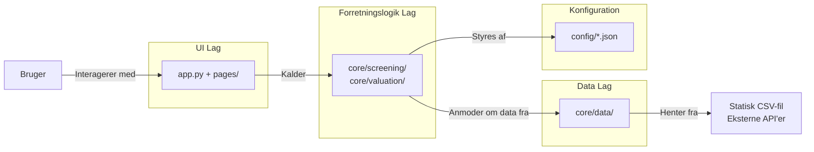

# Teknisk Oversigt over Investment Screener

Dette dokument er hovedindgangen til den tekniske dokumentation for Investment Screener-projektet. Formålet er at give et højniveau-overblik over systemets arkitektur og fungere som en guide til de detaljerede dokumenter for hver kernekomponent.

## Systemarkitektur

Applikationen er bygget op omkring en klassisk trelagsarkitektur, der adskiller præsentation, forretningslogik og datahåndtering. Dette sikrer et modulært og vedligeholdelsesvenligt design.

### Lagbeskrivelse

1.  **UI Lag (Præsentation):** Håndteres udelukkende af **Streamlit**. Dette lag inkluderer hoved-applikationen (`app.py`), de enkelte sider (`pages/`), og genbrugelige UI-komponenter (`utils/`). Dets primære ansvar er at vise data og fange brugerinput.

2.  **Forretningslogik Lag (Kerne):** Dette er applikationens hjerne. Det indeholder de komplekse algoritmer for screening (`core/screening/`) og værdiansættelse (`core/valuation/`). Dette lag er designet til at være uafhængigt af UI'et; det modtager data, udfører beregninger og returnerer et resultat.

3.  **Data Lag:** Håndterer al interaktion med datakilder. Det er opdelt i to ansvarsområder:
    *   **Statisk Data:** Indlæsning og rensning af den indledende Finviz CSV-fil (`core/data/csv_processor.py`).
    *   **Dynamisk Data:** Hentning af live og historisk data fra eksterne API'er (`core/data/client.py`), komplet med caching og rate limiting.

### Interaktion mellem lag

Flowet i applikationen er typisk top-down. En brugerinteraktion i **UI Laget** (f.eks. at køre en screening) udløser et kald til **Forretningslogik Laget**. Dette lag, styret af regler fra **Konfigurationsfilerne**, anmoder derefter **Data Laget** om de nødvendige data. Data Laget returnerer data, som forretningslogikken behandler og sender tilbage til UI Laget for præsentation. Hele processen er bundet sammen af et centraliseret state management-system (`st.session_state`).

## Indholdsfortegnelse

For en dybdegående forståelse af hver komponent, se venligst de følgende dokumenter, som typisk findes i en `docs/`-mappe:

*   **[1. Konfiguration og Dataloading](./01_CONFIG_AND_DATA_LOADING.md):** Forklarer, hvordan screeningsprofiler er defineret i JSON, og hvordan den indledende CSV-fil bliver indlæst og renset.
*   **[2. API Klient](./02_API_CLIENT.md):** Detaljerer, hvordan applikationen kommunikerer med eksterne API'er, håndterer rate limits og bruger caching for at optimere ydeevnen.
*   **[3. Screenings-motor](./03_SCREENING_ENGINE.md):** En dybdegående gennemgang af point-beregning, vægtning og den kritiske sektor-normaliseringsalgoritme.
*   **[4. Værdiansættelses-motor](./04_VALUATION_ENGINE.md):** Forklarer den finansielle modellering bag DCF-analysen, WACC-beregning og scenarieanalyse.
*   **[5. UI Implementering](./05_UI_IMPLEMENTATION.md):** Beskriver, hvordan Streamlit bruges til navigation, state management og integration med interaktive AgGrid-tabeller.
*   **[6. Værktøjer og Hjælpefunktioner](./06_UTILITIES.md):** Dækker de understøttende moduler for validering, favoritstyring og mere.